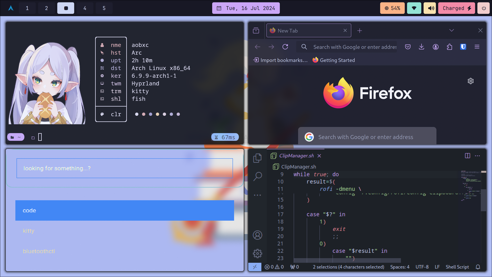
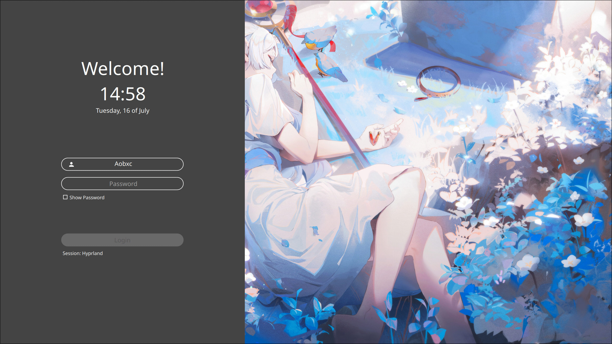
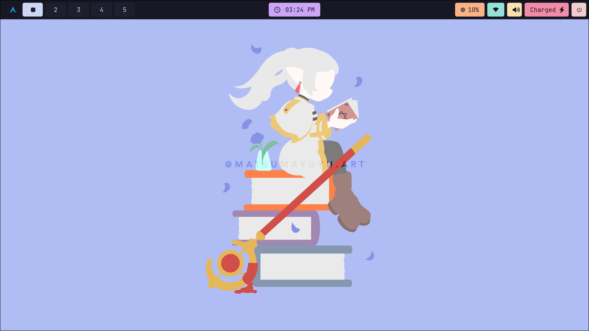
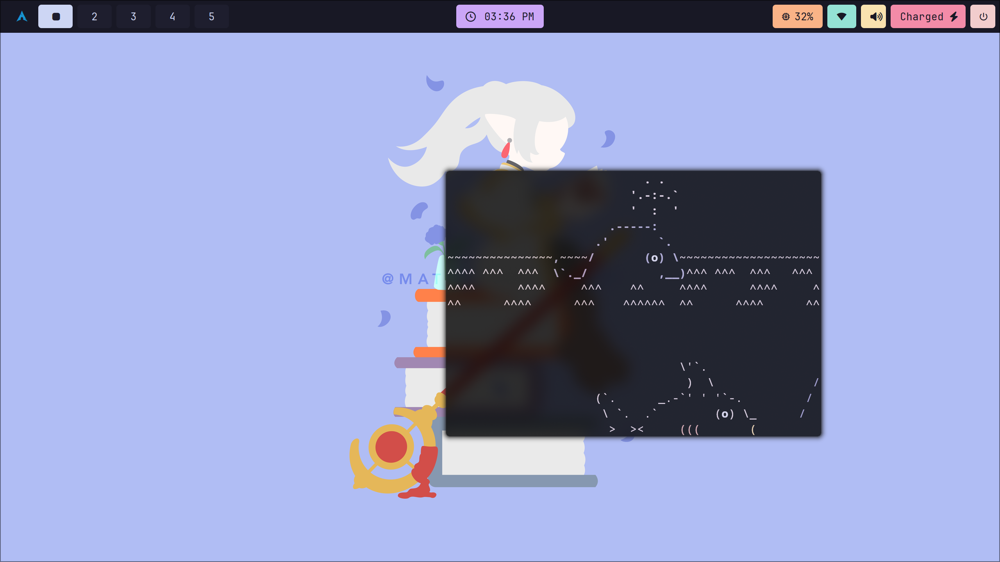

<!DOCTYPE html>
<html lang="en">
<head>
    <meta charset="UTF-8">
    <meta name="viewport" content="width=device-width, initial-scale=1.0">
</head>
<body>

<h1 align="center">Frieren Hyprland Dotfiles</h1>

    

Dotfiles configuration for Frieren Hyprland setup.   Created in Arch Linux with Hyprland.
  
<b>Disclaimer: This is a work in progress.</b>

<h2>📦 Main Packages</h2>

List of main packages and tools used.

<table>
    <tr>
        <th>Component</th>
        <th>Program</th>
    </tr>
    <tr>
        <td>Display Manager ✨</td>
        <td><a href="https://github.com/sddm/sddm">sddm</a></td>
    </tr>
    <tr>
        <td>Windows Manager 🧙‍♂️</td>
        <td><a href="https://github.com/hyprwm/Hyprland">hyprland</a></td>
    </tr>
    <tr>
        <td>Lockscreen 🔒</td>
        <td><a href="https://github.com/hyprwm/hyprlock">hyprlock</a></td>
    </tr>
    <tr>
        <td>Bar 🌟</td>
        <td><a href="https://github.com/Alexays/Waybar">waybar</a></td>
    </tr>
    <tr>
        <td>Fetch 🖼️</td>
        <td><a href="https://github.com/iinsertNameHere/catnip">catnip</a></td>
    </tr>
    <tr>
        <td>Shell 🐚</td>
        <td><a href="https://fishshell.com"/>fish</a></td>
    </tr>
    <tr>
        <td>Terminal 🖥️</td>
        <td><a href="https://github.com/kovidgoyal/kitty">kitty</a></td>
    </tr>
    <tr>
        <td>Launcher ✨</td>
        <td><a href="https://github.com/davatorium/rofi">rofi</a></td>
    </tr>
    <tr>
        <td>Color Theme 🎨</td>
        <td><a href="https://github.com/dylanaraps/pywal">pywal</a></td>
    </tr>
    <tr>
        <td>Wallpaper Engine 🖼️</td>
        <td><a href="https://github.com/Horus645/swww">swww</a></td>
    </tr>
    <tr>
        <td>Prompt Theme ✨</td>
        <td><a href="https://github.com/starship/starship">starship</a></td>
    </tr>
</table>

<h2>✨ Preview ✨</h2>

    
    

<h2>📝 Credits</h2>

<ul>
    <li><b>Main inspiration</b> - <a href="https://github.com/Spelljinxer/dotfiles">Spelljinxer's dotfiles</a></li>
    <li><b>Starship theme</b> - <a href="https://github.com/rubyowo/dotfiles">starship theme</a></li>
    <li><b>Waybar theme</b> - <a href="https://github.com/sameemul-haque/dotfiles/tree/mocha">waybar theme</a></li>
    <li><b>original sddm theme</b> - <a href="https://github.com/MarianArlt/sddm-sugar-dark">ssdm-sugar-dark</a></li>
    <li><b>waybar theme</b> - <a href="https://github.com/sameemul-haque/dotfiles">sameemul's dotfiles</a></li>
</ul>

<h2>📸 More Screenshots</h2>

    

    

    

</body>
</html>
